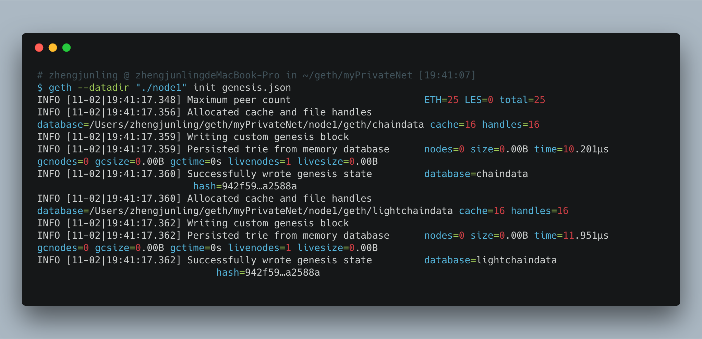

* content
{:toc}
# 一、安装geth


## 1. 什么是geth？

geth是go版本客户端，是目前主流的链接以太坊网络的客户端。

不同平台均提供[下载](https://ethfans.org/wikis/Home)

## 2. geth使用

参数介绍//TODO

# 二、网络介绍

## 1. 主网络

## 2. 测试网络

## 3. 开发网络

在Mist中切换到私有网络的时候， 就是会启动这个模式，这个模式是临时的，创建的账户和合约在关闭Mist时会消失，所以使用的时候要注意

## 4. 私有网络

- 这个是使用创世文件genesis.json创建的本地网络，创建的账户真实的存储到本地，是本文的重点
- 前三网络上的交易都是公共可见的，有专门的网络浏览器可以查阅。
- 私有网络上的交易若想查看需要自行安装浏览器，仓库如下：

```sh
git clone https://github.com/etherparty/explorer
```

# 三、私有网络搭建

## 1. 准备创世文件 genesis.json

```json
{
 "alloc": {},
 "config": {
   "chainID": 72,
   "homesteadBlock": 0,
   "eip155Block": 0,
   "eip158Block": 0
 },
 "nonce": "0x0000000000000000",
 "difficulty": "0x4000",
 "mixhash": "0x0000000000000000000000000000000000000000000000000000000000000000",
 "coinbase": "0x0000000000000000000000000000000000000000",
 "timestamp": "0x00",
 "parentHash": "0x0000000000000000000000000000000000000000000000000000000000000000",
 "extraData": "0x11bbe8db4e347b4e8c937c1c8370e4b5ed33adb3db69cbdb7a38e1e50b1b82fa",
 "gasLimit": "0xffffffff"
}
```

## 2. 创建一个文件夹，指定为私有网络数据存储位置

```
mkdir myPrivateNet
cd myPrivateNet
mv genesis.json ./      //<--这个genesis.json放到这里是便于管理，位置不限，能访问即可
```

## 3. 创建私有链

```
geth --datadir "./node1" init genesis.json
```

执行效果



## 4. 启动私有链节点

```
geth --datadir "./node1" --networkid 72 --port 30301 console
```

- --datadir: 指定节点数据存储路径，此处会自动创建 `node1`，之所以这样命名，是因为后面会创建`node2`，便于模拟多个节点交互
- --networkid: 当前网络的id，写在genesis.json中的
- --port 端口
- console: 表明同时启动一个交互的终端(非必要)

这个关键字可以省略，省略的话表明只启动节点服务，不创建交互终端，后面如果想接入这个节点的话，可以通过attach命令接入，后面讲。 
效果：


1. 另起一个终端，查看node1下面的内容

```shell
[duke ~/ethStudy/myPrivateNet]$ tree node1 -d
node1
├── geth
│   ├── chaindata
│   ├── lightchaindata
│   └── nodes
└── keystore

5 directories
```

至此，私有网络已搭建完成，下面开始执行各项命令

# 四、私有链基本命令

```shell
instance: Geth/v1.8.11-stable-dea1ce05/darwin-amd64/go1.10.3
 modules: admin:1.0 debug:1.0 eth:1.0 miner:1.0 net:1.0 personal:1.0 rpc:1.0 txpool:1.0 web3:1.0
```

## 1. 查看当前网络账户

```
> eth.accounts
[]  <--当前网络账户为空
>
```

注，，我们在创世块中可以预先指定一些账户，在alloc字段

```shell
"alloc": {
      "7df9a875a174b3bc565e6424a0050ebc1b2d1d82": {
        "balance": "300000"
      },
      "f41c74c9ae680c1aa78f42e5647a62f353b7bdde": {
        "balance": "400000"
      }
}
```

## 2. 创建账户

```shell
> 
> personal.newAccount("1111")
"0xe5c9766404eb3633163c85ef13e7a1f79cdee922"
> 
> 
> eth.accounts
["0xe5c9766404eb3633163c85ef13e7a1f79cdee922"]
>
```

其中，"1111"是这个账户的密码

## 3. 多创建几个账户，并查看当前节点矿工

```shell
> personal.newAccount("111")
"0x5032641c3f09bc8995a60c485b9ca4ac3d073fd8"
> personal.newAccount("111")
"0x864ced8aff4b883c99ab1c5156f2d51c47b25f8f"
> personal.newAccount("111")
"0xf3b1e1712a311443db772c55e12c9634912199ab"
> personal.newAccount("111")
"0xef89f85b7e276dcf738276df88888298cd9272ee"
>
> eth.coinbase
INFO [07-16|07:54:10] Etherbase automatically configured       address=0x5032641c3f09bc8995a60C485B9Ca4ac3d073fD8
"0x5032641c3f09bc8995a60c485b9ca4ac3d073fd8"
>
```

可以看到，默认的矿工是第一个账户，可以通过eth.accounts来查看当前节点的所有账户，为了方便记忆，我们把所有的账户密码都设置为”1111“。 

查看一下keystore目录，可以看到创建了四个账户文件

```shell
[duke ~/ethStudy/myPrivateNet]$ ls node1/keystore/
UTC--2018-07-15T23-52-31.825281356Z--5032641c3f09bc8995a60c485b9ca4ac3d073fd8
UTC--2018-07-15T23-53-42.431125900Z--864ced8aff4b883c99ab1c5156f2d51c47b25f8f
UTC--2018-07-15T23-53-44.166684858Z--f3b1e1712a311443db772c55e12c9634912199ab
UTC--2018-07-15T23-53-45.567447952Z--ef89f85b7e276dcf738276df88888298cd9272ee
[duke ~/ethStudy/myPrivateNet]$
```


## 4. 手动修改挖矿的账户

```shell
> miner.setEtherbase(eth.accounts[1])
true
> eth.coinbase
"0x864ced8aff4b883c99ab1c5156f2d51c47b25f8f"
>
```

可以看到coinbase的值已经改变，挖矿的时候，奖励会发给指定的账户。 
==注，每次节点重新启动时，会自动将coinbase设置为第一个账户。==

## 5. 查看账户余额

```shell
> eth.getBalance(eth.accounts[0])
0
> eth.getBalance(eth.accounts[1])
0
```

没有挖矿，也没有转账，当前余额均为0。 

## 6. 挖矿

```
> miner.start()
```

执行效果：

```shell
> miner.start()
INFO [07-16|07:56:48] Updated mining threads                   threads=0
INFO [07-16|07:56:48] Transaction pool price threshold updated price=18000000000
INFO [07-16|07:56:48] Starting mining operation 
null
> INFO [07-16|07:56:48] Commit new mining work                   number=1 txs=0 uncles=0 elapsed=166.057µs
INFO [07-16|07:56:50] Successfully sealed new block            number=1 hash=2a840c…6e5118
INFO [07-16|07:56:50] 🔨 mined potential block                  number=1 hash=2a840c…6e5118
INFO [07-16|07:56:50] Commit new mining work                   number=2 txs=0 uncles=0 elapsed=165.72µs
INFO [07-16|07:56:50] Successfully sealed new block            number=2 hash=f220e8…ffef15
INFO [07-16|07:56:50] 🔨 mined potential block                  number=2 hash=f220e8…ffef15
INFO [07-16|07:56:50] Commit new mining work                   number=3 txs=0 uncles=0 elapsed=133.196µs
```

执行后开始刷屏，停止挖矿

```
> miner.stop()
```

再次查看余额 

```
> eth.getBalance(eth.coinbase)
65000000000000000000
> 
> eth.getBalance(eth.accounts[0])
0
>
```

单位是wei，矿工得到奖励，其他账户为零。

可以使用web3接口，将金额进行转换成ether单位，每个块奖励5个ether，共13个块，所以是5 * 13 = 65个奖励

```
> web3.fromWei(eth.getBalance(eth.coinbase), "ether")
65
> eth.blockNumber
13
>
```


## 7. 检查节点

```
> admin.peers
[]
>
```

当前网络仅一个节点，所以返回空 

## 8. 创建一个新节点

步骤同上 

```
geth --datadir "./node2" init genesis.json
geth --datadir "./node2" --networkid 72 --port 30302
```

注意：

- ==init操作千万不要忘记执行，直接执行启动也会成功运行，但是后续添加节点等总是失败，一定要注意！==

- ==此处我们创建node2，port修改为30302，但是没有指定 console，这是为了演示attach命令==

- ==两个节点想互连的话，必须都指定--networkid 72==


## 9. 使用attach参数，创建接入节点的控制台

```
geth attach ipc:note2/geth.ipc
```

执行效果：

```
[duke ~/ethStudy/myPrivateNet]$ geth attach ipc:note2/geth.ipc 
Welcome to the Geth JavaScript console!

instance: Geth/v1.8.11-stable-dea1ce05/darwin-amd64/go1.10.3
 modules: admin:1.0 debug:1.0 eth:1.0 miner:1.0 net:1.0 personal:1.0 rpc:1.0 txpool:1.0 web3:1.0

>
```

此处geth.ipc在node2下面，这个节点启动后，自动生成，节点停止后自动删除。

在node2中，创建新账户

```shell
> personal.newAccount("111")
"0x6cf4d0785589497d3b5fca83571097f5cd6df352"
>
> personal.newAccount("111")
"0x1757a2db3fd67f0724bffffc33428faa7e9552f7"
>
```

## 10. 在node2中，查看当前节点的信息

```
> admin.nodeInfo
```

执行结果：

```shell
> admin.nodeInfo
{
  enode: "enode://3e707df543403f724144c8d51656b1399c1b9d5ae1d50f5739e02ef06130f1a11fd02baa320552ce1e6f90a7f45f4e37b1caa4d0f45eefcc97606cc16c150197@192.168.1.65:30302",
  id: "3e707df543403f724144c8d51656b1399c1b9d5ae1d50f5739e02ef06130f1a11fd02baa320552ce1e6f90a7f45f4e37b1caa4d0f45eefcc97606cc16c150197",
  ip: "192.168.1.65",
  listenAddr: "[::]:30302",
  name: "Geth/v1.8.11-stable-dea1ce05/darwin-amd64/go1.10.3",
  ports: {
    discovery: 30302,
    listener: 30302
  },
  protocols: {
    eth: {
      config: {
        chainId: 72,
        eip150Hash: "0x0000000000000000000000000000000000000000000000000000000000000000",
        eip155Block: 0,
        eip158Block: 0,
        homesteadBlock: 0
      },
      difficulty: 1725312,
      genesis: "0x942f596f99dc8879b426b59080824662e1f97587353d087487fea0a0e2a2588a",
      head: "0x17fa69432921727241ea299ab7f12611e09bb5a8473e71f1250f89832661ed86",
      network: 72
    }
  }
}
>
```

encode字段能唯一标识这个节点，我们将它添加到node1中。

也可以直接获取enode字段

```js
> admin.nodeInfo.enode
"enode://3e707df543403f724144c8d51656b1399c1b9d5ae1d50f5739e02ef06130f1a11fd02baa320552ce1e6f90a7f45f4e37b1caa4d0f45eefcc97606cc16c150197@192.168.1.65:30302"
>
```

## 11. 在node1中添加node2节点

切换到node1终端，执行下面的命令：

```js
> admin.addPeer("enode://3e707df543403f724144c8d51656b1399c1b9d5ae1d50f5739e02ef06130f1a11fd02baa320552ce1e6f90a7f45f4e37b1caa4d0f45eefcc97606cc16c150197@192.168.1.65:30302")
```

添加后，查看节点信息，可以看到，已经添加进来

```shell
> admin.peers

[{
    caps: ["eth/63"],
    id: "3e707df543403f724144c8d51656b1399c1b9d5ae1d50f5739e02ef06130f1a11fd02baa320552ce1e6f90a7f45f4e37b1caa4d0f45eefcc97606cc16c150197",
    name: "Geth/v1.8.11-stable-dea1ce05/darwin-amd64/go1.10.3",
    network: {
      inbound: false,
      localAddress: "192.168.0.107:57154",
      remoteAddress: "192.168.1.65:30302",
      static: true,
      trusted: false
    },
    protocols: {
      eth: {
        difficulty: 16384,
        head: "0x942f596f99dc8879b426b59080824662e1f97587353d087487fea0a0e2a2588a",
        version: 63
      }
    }
}]
>
```

## 12. 发送交易

由node1账户向node2账户发送一笔交易

在node2中获取第一个账户的地址，该账户当前余额为零

```shell
> eth.accounts[0]
"0x6cf4d0785589497d3b5fca83571097f5cd6df352"
> eth.getBalance(eth.accounts[0])
0
```

切换回node1，执行如下命令：

查看node1中账户余额状态：

```shell
> eth.getBalance(eth.accounts[0])
0
> eth.getBalance(eth.accounts[1])
65000000000000000000
```

我们使用accounts[1]向node2的accounts[0]转账15个ether

```python
> eth.sendTransaction({from : eth.accounts[1], to: "0x6cf4d0785589497d3b5fca83571097f5cd6df352", value: web3.toWei(15, "ether")})
>
```

此时会报错如下

```
Error: authentication needed: password or unlock
    at web3.js:3143:20
    at web3.js:6347:15
    at web3.js:5081:36
    at <anonymous>:1:2
>
```

这说明当前账户被锁定，需要解锁后才能发起交易。

## 13. 解锁这个from指定的账户

```python
> personal.unlockAccount(eth.accounts[1])
```

效果：

```shell
> personal.unlockAccount(eth.accounts[1])
Unlock account 0x864ced8aff4b883c99ab1c5156f2d51c47b25f8f
Passphrase: 
true
>
```

重新发送交易，可以看到如下效果，交易创建成功，同时返回交易hash

```shell
> eth.sendTransaction({from : eth.accounts[1], to: "0x6cf4d0785589497d3b5fca83571097f5cd6df352", value: web3.toWei(15, "ether")})

INFO [07-16|08:38:58] Submitted transaction                    fullhash=0x1cd7f14436a088586d9bb75db6cadec08f4293d270b21c72b237605d4b921bea recipient=0x6cf4D0785589497D3B5fca83571097F5cD6dF352
"0x1cd7f14436a088586d9bb75db6cadec08f4293d270b21c72b237605d4b921bea"
>
```

## 14. 查看交易状态

交易发送到网络中后，需要矿工打包才能写入区块，查看当前该交易的状态

```
>txpool.status
```

效果

```shell
> txpool.status
{
  pending: 1,  //<--- 等待被打包
  queued: 0
}
>
```

在node2中启动挖矿，然后停止挖矿，在node1中重新查看

node2:

```
> miner.start()
null
> miner.stop()
true
>
```

 node1:

```shell
> INFO [07-16|08:41:44] Block synchronisation started 
INFO [07-16|08:41:44] Imported new chain segment               blocks=2 txs=1 mgas=0.021 elapsed=565.360ms mgasps=0.037 number=15 hash=b2be14…d19460 cache=3.33kB
INFO [07-16|08:41:44] Imported new chain segment               blocks=1 txs=0 mgas=0.000 elapsed=4.209ms   mgasps=0.000 number=16 hash=752b6a…2164c9 cache=3.73kB
INFO [07-16|08:41:44] Mining too far in the future             wait=2s
INFO [07-16|08:41:47] Imported new chain segment               blocks=1 txs=0 mgas=0.000 elapsed=4.799ms   mgasps=0.000 number=17 hash=68b112…82e15e cache=4.12kB
INFO [07-16|08:41:47] Imported new chain segment               blocks=1 txs=0 mgas=0.000 elapsed=4.190ms   mgasps=0.000 number=18 hash=9ca0f2…2685c9 cache=4.51kB
INFO [07-16|08:41:47] Imported new chain segment               blocks=1 txs=0 mgas=0.000 elapsed=2.166ms   mgasps=0.000 number=19 hash=7376ea…8c9461 cache=4.90kB
INFO [07-16|08:41:47] Mining too far in the future             wait=2s
INFO [07-16|08:41:51] Imported new chain segment               blocks=1 txs=0 mgas=0.000 elapsed=4.604ms   mgasps=0.000 number=20 hash=35227e…9c2aa3 cache=5.29kB

> 
> txpool.status

{
  pending: 0,
  queued: 0
}
>
```

可以看到，pending数目变为0，说明交易已经被打包到区块内。

查看交易后的金额，

node1中：

```
> eth.getBalance(eth.accounts[1])
49999622000000000000
>
```

node1 的 accounts[1] 账户变为 65 - 15 - 手续费 = 49.99，正确

node2中：

```
> eth.getBalance(eth.accounts[0])
50000378000000000000

> web3.fromWei(eth.getBalance(eth.accounts[0]), "ether")
50.000378
>
```

我们发现，accounts[0]的值并非15，为何？

原因是这个账户也是coinbase账户，刚刚参与了挖矿，得到了挖矿的奖励

```
> eth.blockNumber
20
```

当前区块数为20，有13个块是从node1节点同步过来的，刚刚我们运行miner.start()一共产生了7个区块，

每个区块奖励5， 共得到奖励 35ether，加上转账获得的15个，为50，再加上手续费，所以总数为50.000378。

# 五、Ethereum连接私有链

Ethereum默认安装目录

- Mac: ~/Library/Ethereum
- Linux: ~/.ethereum
- Windows: %APPDATA%\Ethereum

我们启动Ethereum客户端，此时连接的是测试网络：


我们通过命令行，查看它起的节点命令如下：

Ethereum启动geth命令：

Mac查看方式 :

```shell
ps -ef | grep geth
```

返回如下信息：

```shell
/Users/duke/Library/Application Support/Mist/binaries/Geth/unpacked/geth --testnet --syncmode light --cache 1024 --ipcpath /Users/duke/Library/Ethereum/geth.ipc
```

Windows查看方式：

```shell
wmic process where caption="geth.exe" get caption,commandline /value
```

请自行查看。

Ethereum客户端每次都要指定特定的geth.ipc，指定--testnet 来和测试网络连接，--testnet参数就是Ropsten网络。

我们可以事先拉起一个geth服务，其中将存储数据参数指定为我们的私有网络，这样Mist在启动时，就会自动连接到我们的服务，而不会重新起服务。

Mac:

```shell
geth  --datadir ./node1  --ipcpath /Users/duke/Library/Ethereum/geth.ipc
```

Windows的ipc是固定的：

```shell
geth  --datadir .\node1  --ipcpath \\.\pipe\geth.ipc
```

重新打开Etherueum钱包，界面如下：


在命令行，我们通过attach建立一个终端，查看账户信息，我们发现与图形界面一致。

Mac:

```
geth attach ipc:/Users/duke/Library/Ethereum/geth.ipc
```

Windows :

```
geth attach ipc:\\.\pipe\geth.ipc
```

==注意，此时的ipc应该使用上面的geth.ipc，注意路径，这个钱包自动生成的，并不在我们的node1目录下面。==

执行

```shell
> eth.accounts
["0x5032641c3f09bc8995a60c485b9ca4ac3d073fd8", "0x864ced8aff4b883c99ab1c5156f2d51c47b25f8f", "0xf3b1e1712a311443db772c55e12c9634912199ab", "0xef89f85b7e276dcf738276df88888298cd9272ee"]
>
```

至此，我们完成了私有链的搭建

我们学会如下知识点：

- 了解geth搭建私有链
- 熟悉基本的web3接口命令
- 使用Ethereum客户端连接到私有网络

