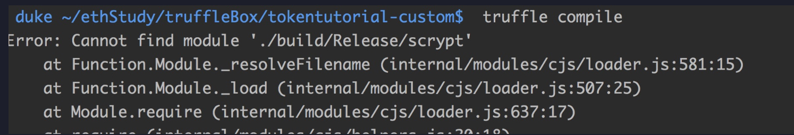
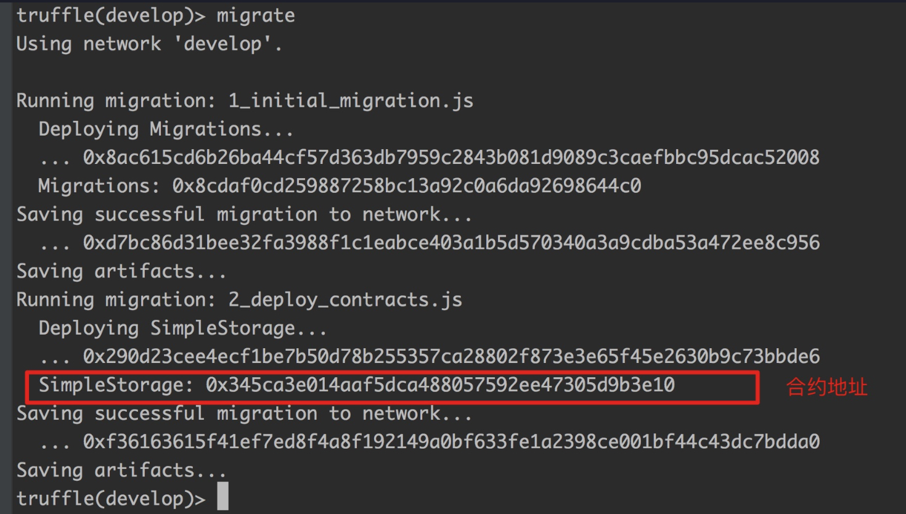
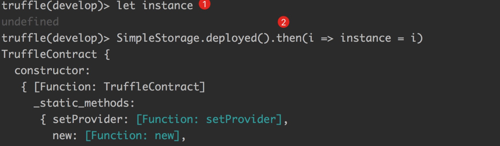

* content
{:toc}
# 一、[什么是truffle](https://truffleframework.com/)

## 1. 概述

truffle是世界级的以太坊开发框架，它使得以太坊开发变得简单高效，它具有以下特点：

1. **内置智能合约编译、链接、开发和二进制管理。**
2. **快速开发的自动化合约测试**
3. **脚本、可扩展性部署和迁移框架。**
4. **用于部署到任意数量的公网和私网的网络管理**
5. 基于EthPM和NPM，并使用ERC190标准进行包管理
6. **为合约通信提供交互式控制台**
7. 为紧密集成提供可配置的构建管道
8. 在Truffle的环境中执行外部的运行脚本

## 2. [官网](https://truffleframework.com/)

官网不稳定，经常无法打开

## 3. [官网本地化](https://github.com/trufflesuite/trufflesuite.com)

将代码克隆到本地，编译，便可在本地访问（完美！）

## 4. [github](https://github.com/trufflesuite)

# 二、如何安装truffle


```sh
npm install -g truffle
```

如果安装过程出现错误，请见[官网](https://truffleframework.com/docs/getting_started/installation)

运行如下命令，测试安装情况：

```sh
truffle version
```

输出如下即安装成功

```shell
[duke ~]$ truffle version
Truffle v4.1.12 (core: 4.1.12)
Solidity v0.4.24 (solc-js)
[duke ~]$
```

# 三、创建空项目

## 3.1 准备工作

```
mkdir truffleProject
mkdir demo1
cd demo1
```

## 3.2 执行命令

```
truffle init
```

执行效果：

```shell
[duke ~/ethStudy/truffleProject/demo1]$ truffle init
(node:1553) ExperimentalWarning: The fs.promises API is experimental
Downloading...
Unpacking...
Setting up...
Unbox successful. Sweet!

Commands:

  Compile:        truffle compile
  Migrate:        truffle migrate
  Test contracts: truffle test
[duke ~/ethStudy/truffleProject/demo1]$
```

此时在当前目录下会生成如下文件：

```shell
[duke ~/ethStudy/truffleProject/demo1]$ ls
contracts         migrations        test              truffle-config.js truffle.js
[duke ~/ethStudy/truffleProject/demo1]$
```

- contracts: 存放合约文件
- migrations：存放部署相关文件
- test：用于做单元测试
- truffle.js：配置文件，告诉truffle部署到哪个网络（测试网络，主网，私有网络等），非windows平台使用
- truffle-config.js：同truffle.js，仅供windows平台使用

## 3.3 添加合约代码

在contracts文件夹下，创建文件SimpleStorage.sol，并贴入如下代码：

```javascript
pragma solidity ^0.4.18;


contract SimpleStorage {
    uint storedData;

    function set(uint x) public {
        storedData = x;
    }

    function get() public view returns (uint) {
        return storedData;
    }
}
```

## 3.4 truffle编译合约

在我们的项目中执行如下命令：- compile命令

```shell
truffle compile
```

输出如下：

```shell
[duke ~/ethStudy/truffleProject/demo1]$ truffle compile
(node:1572) ExperimentalWarning: The fs.promises API is experimental
Compiling ./contracts/Migrations.sol...
Compiling ./contracts/SimpleStorage.sol...
Writing artifacts to ./build/contracts
```

此时会生成`build`目录，里面结果如下：

```shell
[duke ~/ethStudy/truffleProject/demo1]$ tree build/
build/
└── contracts
    ├── Migrations.json
    └── SimpleStorage.json

1 directory, 2 files
[duke ~/ethStudy/truffleProject/demo1]$
```

`compile` 将把我们的 Solidity 代码编译成字节码（以太坊虚拟机 (EVM) 能理解的代码），build文件夹里面的两个文件是根据合约生成的，每一个.sol文件会编译出一个.json文件，json描述文件里面包含合约的`abi`，`bytecode`等相关信息，用于后续部署。

## 3.5 truffle部署合约

我们一般部署在以下三种环境中：

1. truffle自带环境（develop)
2. ganache图形化环境/ganache-cli 命令行环境
3. 真实环境（测试/主网）

## 3.6 修改配置文件

truffle.js是非windows平台的配置文件，windows使用truffle-coinfig.js。

在这里可以指定合约的部署网络以及该网络的各项参数。

默认状态下配置信息是空的，如图所示：

```js
/*
 * NB: since truffle-hdwallet-provider 0.0.5 you must wrap HDWallet providers in a 
 * function when declaring them. Failure to do so will cause commands to hang. ex:
 *
```

- mainnet: {
- provider: function() {
- return new HDWalletProvider(mnemonic, '<https://mainnet.infura.io/>')
- },
- network_id: '1',
- gas: 4500000,
- gasPrice: 10000000000,
- }, */

//主要是配置这个里，默认为空 module.exports = { // See <http://truffleframework.com/docs/advanced/configuration> // to customize your Truffle configuration! };

修改如下：

```js
ar HDWalletProvider = require("truffle-hdwallet-provider");

// 你的以太坊钱包地址 進入 MetaMask -> Settings -> reveal seed words 复制到这里
var mnemonic = "smile tissue saddle voice stick case purpose nuclear odor equal supreme amateur";

module.exports = {
    // See <http://truffleframework.com/docs/advanced/configuration>
    // to customize your Truffle configuration!
    networks: {
        development: {
            host: "127.0.0.1",
            port: 9545,
            network_id: "*" // match any network
        },
        ganacheNet: {
            host: "127.0.0.1",
            port: 7545,
            network_id: "*" // match any network
        },
        privateNet: {
            host: "127.0.0.1",
            port: 8545,
            network_id: "*" // match any network
        },
        ropstenNet: {
            provider: function() {
                   return new HDWalletProvider(mnemonic, "https://ropsten.infura.io/v3/02cd1e3c295c425597fa105999493baa")
            },
            network_id: 3,
            gas: 3012388,
            gasPrice: 30000000000
        }
    }
};
```

每一个网络，如果没有指定下面的选项，那么系统会使用下面的默认值：

For each network, if unspecified, transaction options will default to the following values:

- `gas`:部署合约时的gas上限，默认 `4712388`
- `gasPrice`: 部署合约时的gas价格，默认`100000000000` (100 Shannon).
- `from`: 部署合约的地址，如果没指定，默认为第一个账户。
- `provider`: 默认情况下的 web3 provider 会使用指定的 `host` and `port`，如果指定该字段，则会忽略`host`和`port`，同时需要创建`provider`如下: `new Web3.providers.HttpProvider("http://<host>:<port>")`

在这个配置文件中，我们使用了`truffle-hdwallet-provider`，==所以请先安装这个包==。

```sh
npm install truffle-hdwallet-provider --save
```

否则在编译的时候回报错如下：



## 3.7 添加部署脚本

打开 “migrations” 文件夹并创建一个名为 “2_deploy_contracts.js” 的新文件。Migrations 只是帮助我们将合约部署到区块链的脚本。将下面的代码粘贴到里面，然后保存。

```javascript
const myStorage = artifacts.require("./SimpleStorage.sol")

module.exports = function(deployer) {
    deployer.deploy(myStorage);
};
```

第1行是用来导入 “SimpleStorage.sol” 文件的（从 “contracts” 文件夹导出），第4行则将它部署到区块链中。

# 四、truffle部署合约

## 1. 部署在truffle开发模式

在项目中执行如下命令：

### - develop命令

```
truffle develop
```

启动内置开发环境，效果如下：

```shell
[duke ~/ethStudy/truffleProject/demo1]$ truffle develop
Truffle Develop started at http://127.0.0.1:9545/

Accounts:
(0) 0x627306090abab3a6e1400e9345bc60c78a8bef57
(1) 0xf17f52151ebef6c7334fad080c5704d77216b732
(2) 0xc5fdf4076b8f3a5357c5e395ab970b5b54098fef
(3) 0x821aea9a577a9b44299b9c15c88cf3087f3b5544
(4) 0x0d1d4e623d10f9fba5db95830f7d3839406c6af2
(5) 0x2932b7a2355d6fecc4b5c0b6bd44cc31df247a2e
(6) 0x2191ef87e392377ec08e7c08eb105ef5448eced5
(7) 0x0f4f2ac550a1b4e2280d04c21cea7ebd822934b5
(8) 0x6330a553fc93768f612722bb8c2ec78ac90b3bbc
(9) 0x5aeda56215b167893e80b4fe645ba6d5bab767de

Private Keys:
(0) c87509a1c067bbde78beb793e6fa76530b6382a4c0241e5e4a9ec0a0f44dc0d3
(1) ae6ae8e5ccbfb04590405997ee2d52d2b330726137b875053c36d94e974d162f
(2) 0dbbe8e4ae425a6d2687f1a7e3ba17bc98c673636790f1b8ad91193c05875ef1
(3) c88b703fb08cbea894b6aeff5a544fb92e78a18e19814cd85da83b71f772aa6c
(4) 388c684f0ba1ef5017716adb5d21a053ea8e90277d0868337519f97bede61418
(5) 659cbb0e2411a44db63778987b1e22153c086a95eb6b18bdf89de078917abc63
(6) 82d052c865f5763aad42add438569276c00d3d88a2d062d36b2bae914d58b8c8
(7) aa3680d5d48a8283413f7a108367c7299ca73f553735860a87b08f39395618b7
(8) 0f62d96d6675f32685bbdb8ac13cda7c23436f63efbb9d07700d8669ff12b7c4
(9) 8d5366123cb560bb606379f90a0bfd4769eecc0557f1b362dcae9012b548b1e5

Mnemonic: candy maple cake sugar pudding cream honey rich smooth crumble sweet treat

⚠️  Important ⚠️  : This mnemonic was created for you by Truffle. It is not secure.
Ensure you do not use it on production blockchains, or else you risk losing funds.

(node:12216) ExperimentalWarning: The fs.promises API is experimental
truffle(develop)>
```

启动后，会进入交互界面，默认启动本地服务，占用端口号`9545`，同时创建10个虚拟账户，每个账户默认含有100个eth。

### - migrate命令

在终端内直接执行`migrate`命令，完成部署。



在这个develop环境中，内置了web3，我们可以查看一下web3的版本：

```sh
truffle(develop)> web3.version
{ api: '0.20.6',
  node: [Getter],
  getNode: { [Function: get] request: [Function: bound ] },
  network: [Getter],
  getNetwork: { [Function: get] request: [Function: bound ] },
  ethereum: [Getter],
  getEthereum: { [Function: get] request: [Function: bound ] },
  whisper: [Getter],
  getWhisper: { [Function: get] request: [Function: bound ] } }
truffle(develop)>
```

版本比较低，web3的api为老版本的，所以支持同步调用，比如查看当前账户：

```sh
truffle(develop)> web3.eth.accounts
[ '0x627306090abab3a6e1400e9345bc60c78a8bef57',
  '0xf17f52151ebef6c7334fad080c5704d77216b732',
  '0xc5fdf4076b8f3a5357c5e395ab970b5b54098fef',
  '0x821aea9a577a9b44299b9c15c88cf3087f3b5544',
  '0x0d1d4e623d10f9fba5db95830f7d3839406c6af2',
  '0x2932b7a2355d6fecc4b5c0b6bd44cc31df247a2e',
  '0x2191ef87e392377ec08e7c08eb105ef5448eced5',
  '0x0f4f2ac550a1b4e2280d04c21cea7ebd822934b5',
  '0x6330a553fc93768f612722bb8c2ec78ac90b3bbc',
  '0x5aeda56215b167893e80b4fe645ba6d5bab767de' ]
truffle(develop)>
```

部署需要花费gas，我们查看第一账户的余额：

```shell
truffle(develop)> web3.eth.getBalance(web3.eth.accounts[0]).toNumber()
99954808500000000000
truffle(develop)>
```

可以看到小于100，默认情况下由第一个账户进行部署，同时第一个账户也是coinbase。

```sh
truffle(develop)> web3.eth.coinbase
'0x627306090abab3a6e1400e9345bc60c78a8bef57'
truffle(develop)>
```

## 2.与合约交互

### - 使用js文件调用

当我们执行migrate的时， 这个命令会更新SimpleStorage.json文件，将部署在这个指定网络中的地址和对应的交易哈希保存进来。那么我们可以调用通过这个json文件中的信息，调用我们的合约。（后面介绍）

### - 使用命令行调用

我们使用控制台与合约进行交互

- 获取合约实例

  使用truffle框架时，我们会使用truffle的库：truffle-contract，它封装了原生的web3.js，从而实现更加方便的合约调用。

- 调用set函数

  ```sh
  truffle(develop)> instance.set(10, {from : web3.eth.accounts[0]})
  { tx:
     '0xb02298a3a9c86c7ff9fbb2e3e80e5fd2e1b44fed8d72fb7c111d456b7c4b374c',
    receipt:
     { transactionHash:
        '0xb02298a3a9c86c7ff9fbb2e3e80e5fd2e1b44fed8d72fb7c111d456b7c4b374c',
       transactionIndex: 0,
       blockHash:
        '0x03a97cbd240134e1f7aa2eb54c731a93ed45f030fe940c416b90a304f905693c',
       blockNumber: 5,
       gasUsed: 41669,
       cumulativeGasUsed: 41669,
       contractAddress: null,
       logs: [],
       status: '0x01',
       logsBloom:
        '0x00000000000000000000000000000000000000000000000000000000000000000000000000000000000000000000000000000000000000000000000000000000000000000000000000000000000000000000000000000000000000000000000000000000000000000000000000000000000000000000000000000000000000000000000000000000000000000000000000000000000000000000000000000000000000000000000000000000000000000000000000000000000000000000000000000000000000000000000000000000000000000000000000000000000000000000000000000000000000000000000000000000000000000000000000000000' },
    logs: [] }
  truffle(develop)>
  ```